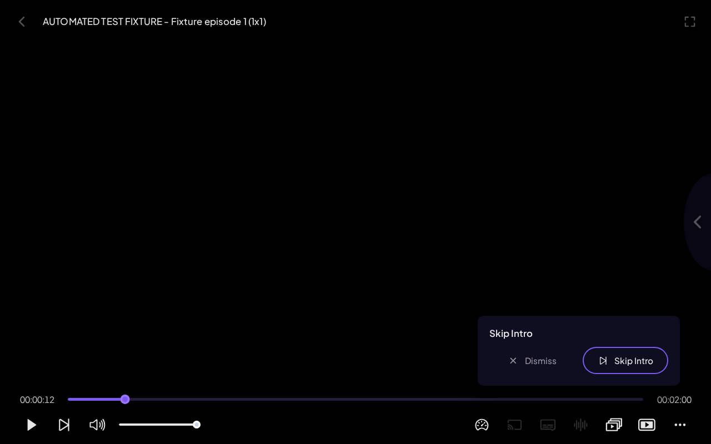
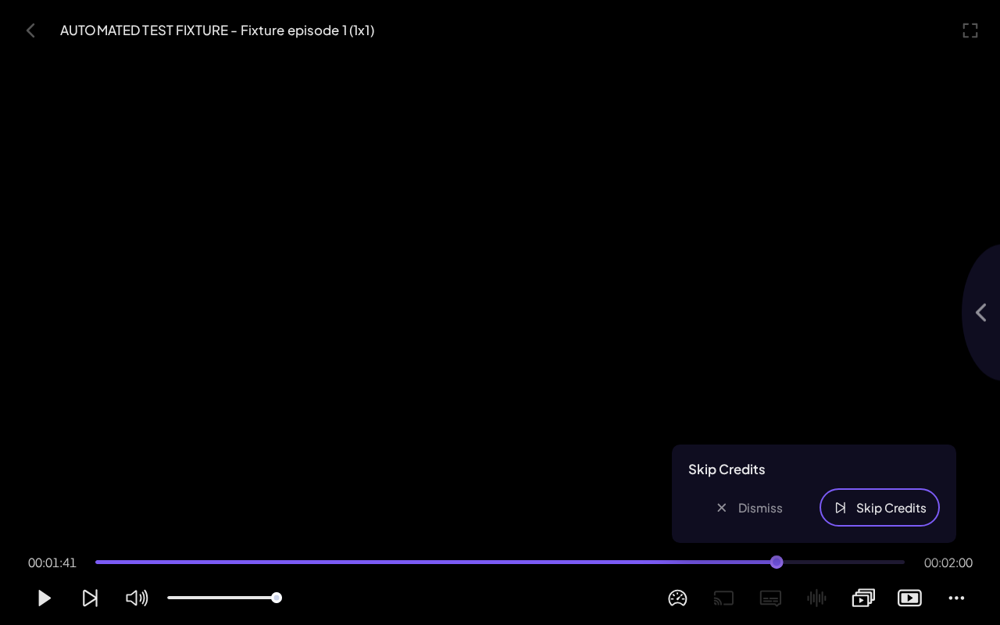

# Verified browser fixture evidence

22 September 2026

These are genuine captures of the compiled Stremio Web player and shared Core worker. Media and provider responses are controlled test fixtures. They are not real provider coverage or native Android TV device evidence.

All 31 runtime cases and 156 unit tests passed. The lint gate passed with zero errors and 264 existing warnings.

## Intro prompt

## Credits prompt

Source hashes and test scope are recorded in MANIFEST.json and RESULTS.json.
